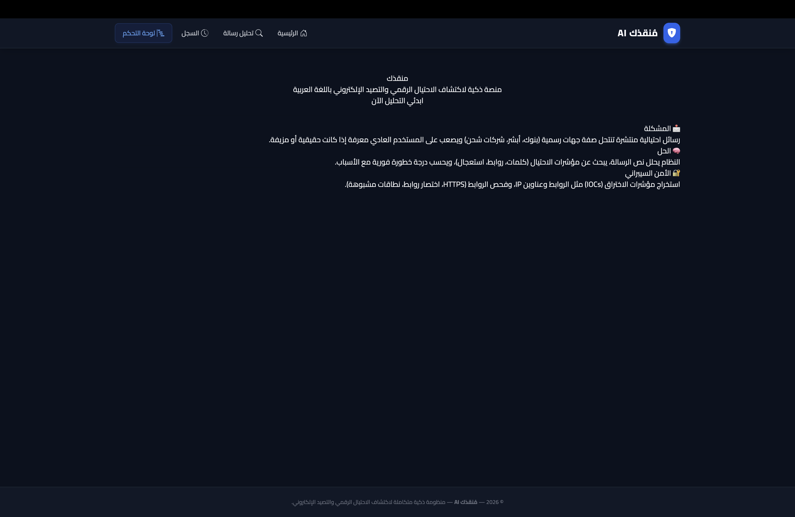
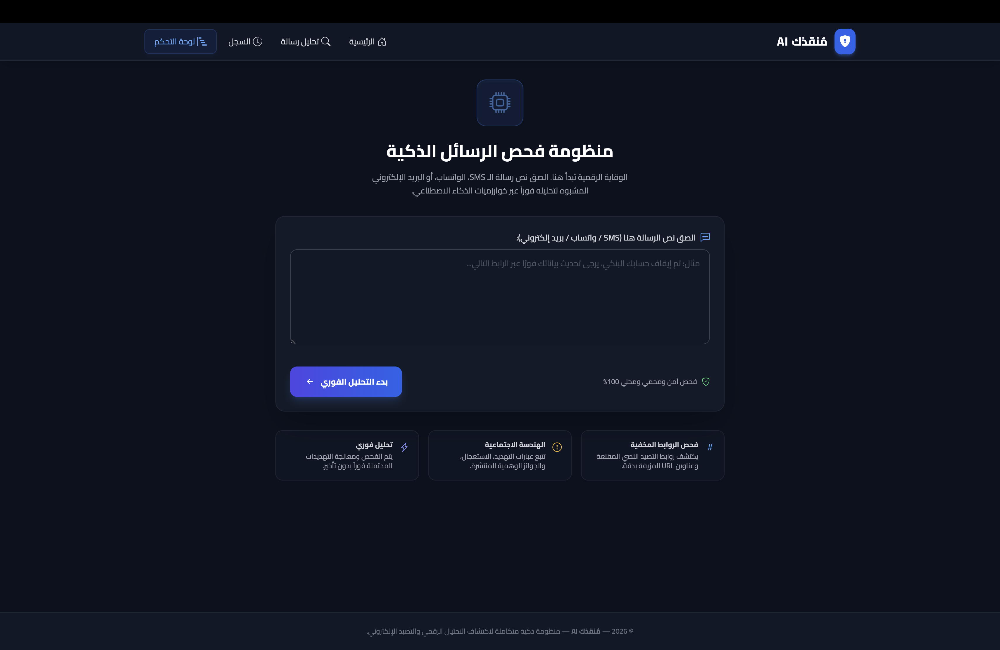
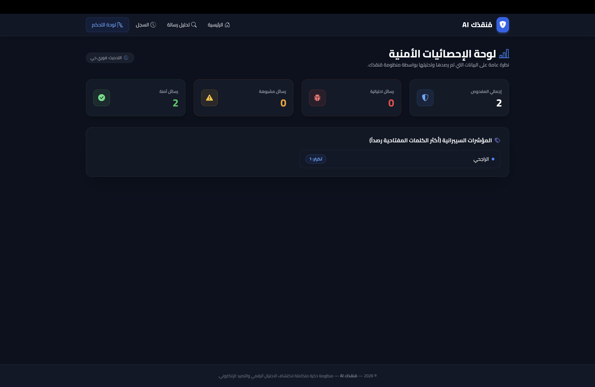
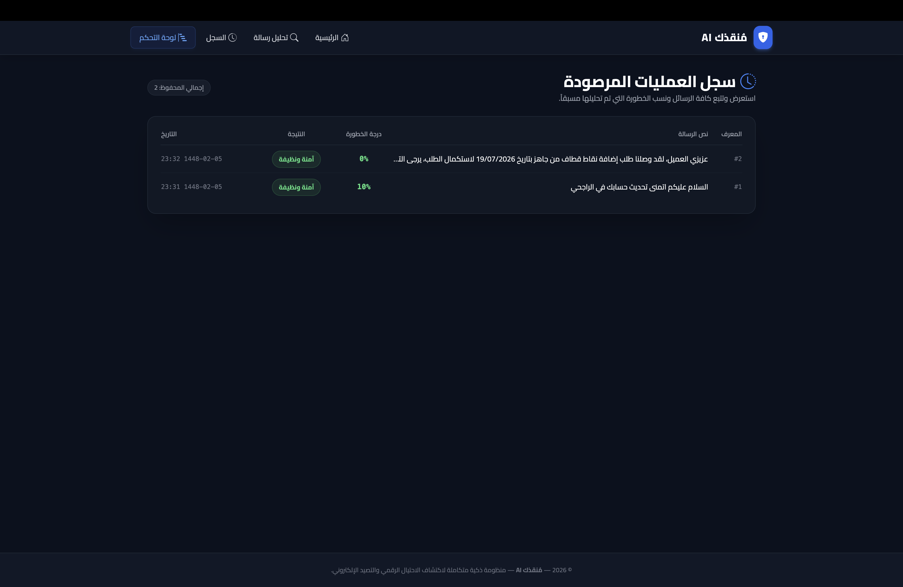

# Munqidh

## Overview
Munqidh is an AI-powered cybersecurity platform designed to detect scam and phishing messages. The platform analyzes suspicious messages and helps users identify potential fraud attempts.

## Features
- AI-powered message analysis
- Scam and phishing detection
- User-friendly dashboard
- Message history tracking
- Security reporting and monitoring

## Technologies Used
- ASP.NET Core
- C#
- SQL Server
- OpenAI API
- HTML, CSS, JavaScript

## Screenshots

### Home Page

### Message Analysis

### Dashboard

### Message History

## Author
Shouq Al-Mutairi
Cybersecurity Graduate
CompTIA Security+ | eJPT
